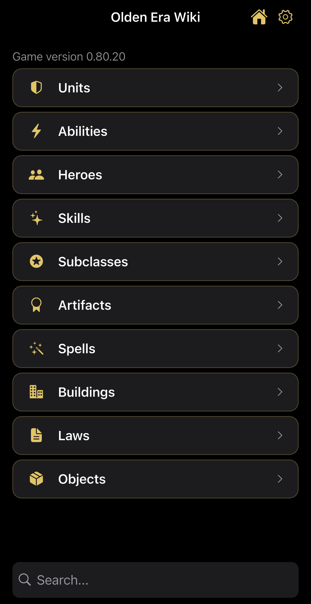
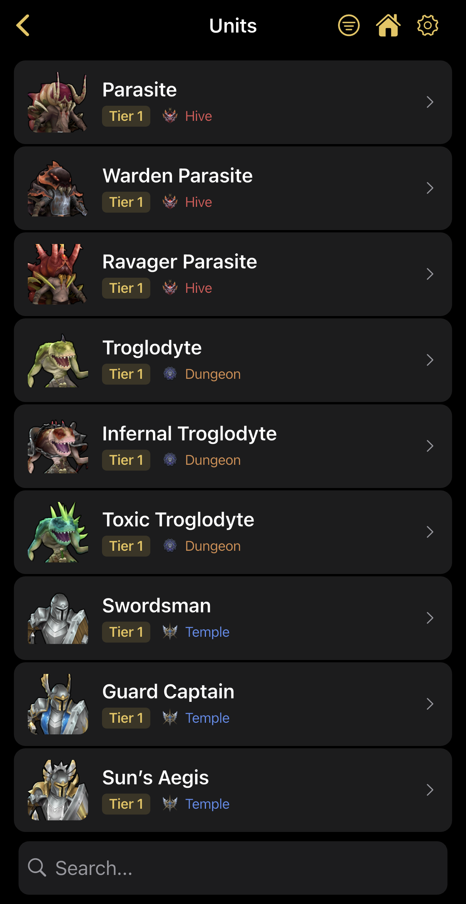
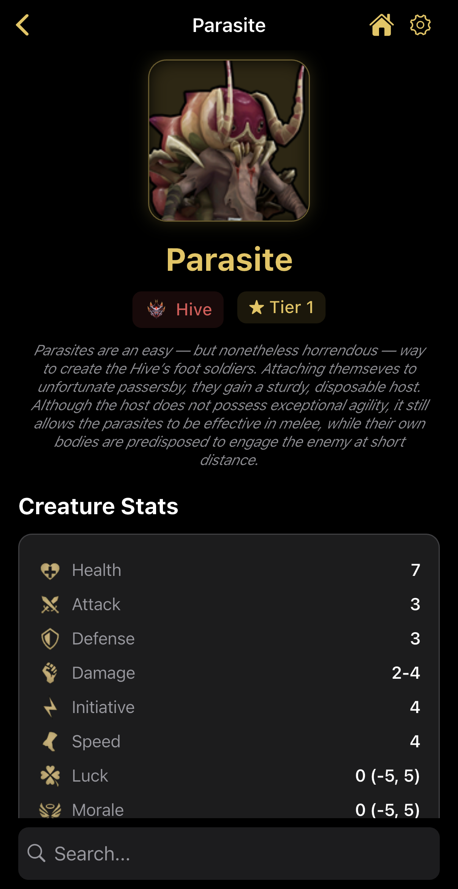
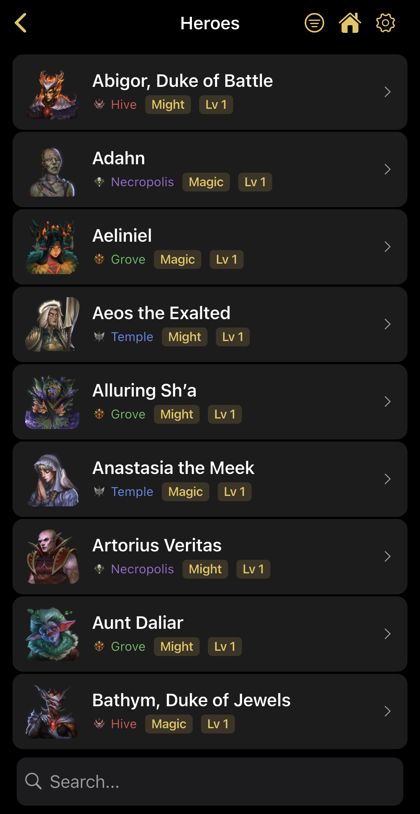
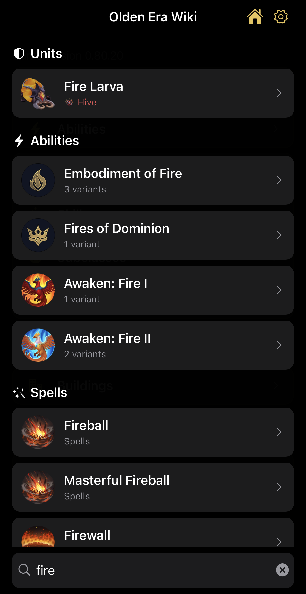

# Olden Era Wiki

Unofficial companion wiki for *Heroes of Might and Magic: Olden Era*. A free, fully offline reference app with comprehensive game data at your fingertips.

## About

Olden Era Wiki gives you instant access to detailed information about every aspect of the game. All data is bundled locally — no internet connection required. The app is completely free with no ads or in-app purchases.

## Screenshots

<p align="center">
  
  
  
  
  
</p>

## Features

**Browse 10 categories of game content:**

- **Units** — stats, abilities, upgrades, and faction info for every unit
- **Abilities** — detailed descriptions with highlighted values
- **Heroes** — hero profiles, specializations, and starting skills
- **Skills** — skill trees with level-by-level descriptions
- **Subclasses** — class specializations and bonuses
- **Artifacts** — artifact stats, set bonuses, and effects
- **Spells** — spell descriptions, costs, and scaling details
- **Buildings** — town building trees and production info
- **Faction Laws** — faction-specific law bonuses
- **Map Objects** — adventure map object descriptions and effects

**Search & navigation:**

- Global full-text search across all categories
- Context-aware search results prioritized by current screen
- Filter units and heroes by faction
- Adjustable font size for comfortable reading

## Platforms

- iOS 13+
- Android (API 21+)

## Building from Source

Requires [Flutter](https://flutter.dev) (stable channel, SDK 3.5+).

```
flutter pub get
flutter run
```

## Updating Game Data

The game database is bundled at `assets/db/wiki.sqlite`. To update it with new game data:

1. Replace `assets/db/wiki.sqlite` with the updated database
2. Bump `kDbAssetVersion` in `lib/data/database.dart` so devices refresh their local copy on next launch

## Disclaimer

This is an unofficial fan project and is not affiliated with, endorsed by, or connected to Unfrozen Studios or Ubisoft. All game content and assets belong to their respective owners.
